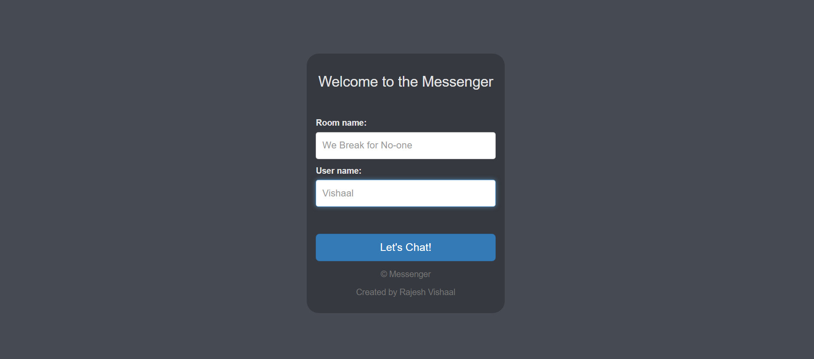
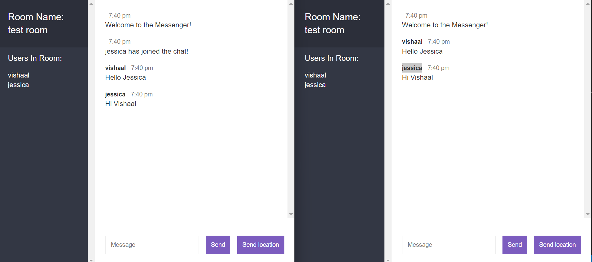

# Messenger

This application is a simple version of a chatting application made using socket.io. The application opens up with a UI that asks the user to put a username and a chatroom name. Two users with the same username cannot exist in the same room and I used validation to ensure that it would never happen. The users are stored inside an array instead of a database as it is a very temporary process. The application uses sockets to ensure that real time communication could happen between different users on the same server. 

How to Run the application:
- Download the files
- go into the file directory and run "npm i"
- run "node app.js"
or just go to "https://rajeshvishaal-messenger.herokuapp.com/"

Below are attached some pictures of the application:

